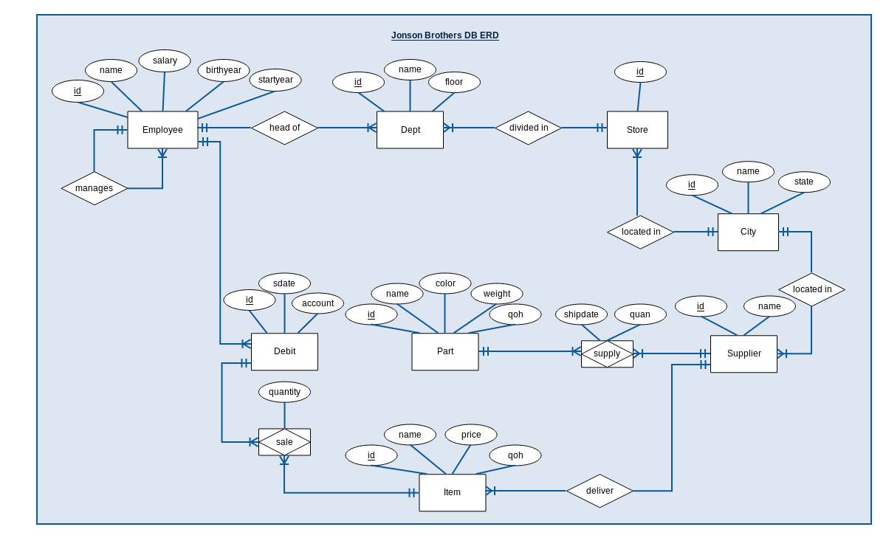
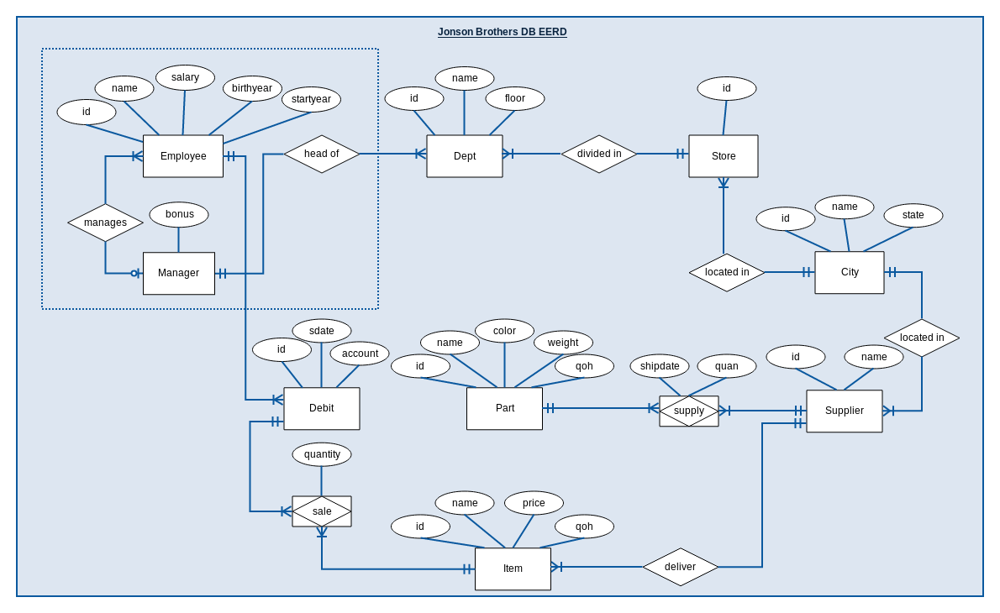
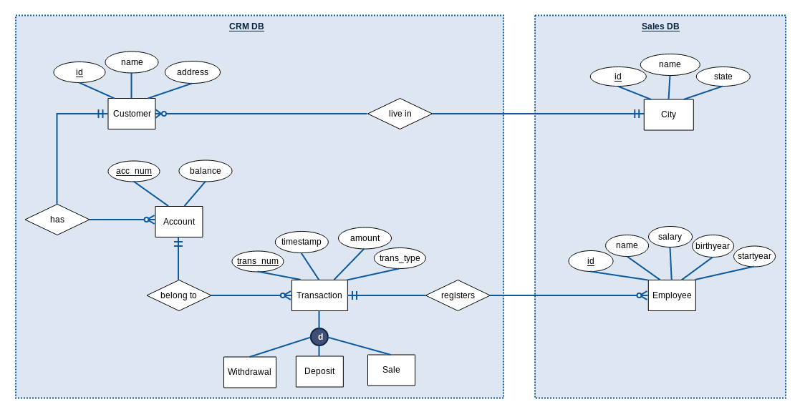

### 1. Analyze the ER-diagram on page 8 (available electronically from the course web page) and the relational database and add information about the cardinality of the relationships such as one-to-one, one-to-many, many-to-one, and many-to-many to the ER-diagram.



### 2. Extend the ER-diagram with an entity type manager that is a subclass of employee. Add support for a manager bonus that is added to the salary by giving the manager entity a bonus attribute. Use the manager-entity (instead of employee) in appropriate, existing relationships. Note that some managers are managers of departments, some managers are managers of other employees, and some are both. Draw your extensions to the ER-diagram and translate them to the relational model.



### 3. Implement your extensions in the database by first creating tables, if any, then populating them with existing manager data, then adding/modifying foreign key constraints. Do you have to initialize the bonus attribute to a value? Why?

###### We have to initialize the bonus attribute to a DEFAULT value = 0. so it's not neccessary to add the bonus value when you insert a new record.

```
CREATE TABLE jbmanager
    (
    `id` INT(11),
    `bonus` INT(11) NOT NULL DEFAULT 0,
    PRIMARY KEY (`id`),
    FOREIGN KEY (`id`) REFERENCES `jbemployee`(`id`)
    );
        
INSERT INTO jb.jbmanager(`id`)
    SELECT * 
    FROM (SELECT manager FROM jbemployee
          UNION
          SELECT manager FROM jbdept) AS mngr
	WHERE mngr.manager IS NOT NULL;
   
ALTER TABLE `jbemployee` 
DROP FOREIGN KEY `fk_emp_mgr`;

ALTER TABLE `jbemployee`
ADD CONSTRAINT `fk_emp_mgr`
FOREIGN KEY (`manager`) REFERENCES `jbmanager` (`id`);

ALTER TABLE `jbdept` 
DROP FOREIGN KEY `fk_dept_mgr`;
                                 
ALTER TABLE `jbdept`
ADD CONSTRAINT `fk_dept_mgr`
FOREIGN KEY (`manager`) REFERENCES `jbmanager` (`id`);
```

### 4. All departments showed good sales figures last year! Give all current department managers $10,000 in bonus. This bonus is an addition to other possible bonuses they have. Hint: Not all managers are department managers. Update all managers that are referred in the _jbdept_ relation.

```
SET SQL_SAFE_UPDATES = 0;
UPDATE `jbmanager` 
  SET bonus = bonus + 10000 
  WHERE id IN (SELECT DISTINCT(manager) FROM jb.jbdept);
SET SQL_SAFE_UPDATES = 1;  

SELECT * FROM jb.jbmanager;
```
```
+-----+-------+
| id  | bonus |
+-----+-------+
|  10 | 10000 |
|  13 | 10000 |
|  26 | 10000 |
|  32 | 10000 |
|  33 | 10000 |
|  35 | 10000 |
|  37 | 10000 |
|  55 | 10000 |
|  98 | 10000 |
| 129 | 10000 |
| 157 | 10000 |
| 199 |     0 |
+-----+-------+
12 rows in set (0,00 sec)
```

### 5. In the existing database, customers can buy items and pay for them, as reflected by the sale and debit tables. Now, you want to create support for storing customer information. The customers will have accounts, where they can deposit and withdraw money. The requirements are:
* Customers are stored with name, street address, city, and state. Use existing city information!
* A customer can have several accounts.
* Accounts are stored with account number, and balance.
* Information about transactions such as the type (withdrawal/deposit/sale), transaction number, account number, date and time of the transaction, amount, and the employee responsible for the transaction (that is, the employee that registers the transaction, not the customer that owns the account) should be stored in a transaction-entity. Use subclasses to distinguish between the different types of transactions (withdrawals/deposits/sales). This means that the new transaction entity will be a superclass of the existing debit-entity.
  
###### Jonson Brothers CRM Database ER Diagram depends on two entities (_Employee_, _City_) from the EER Diagram, so we did darw our new CRM ERD using only both of them for illustration.

